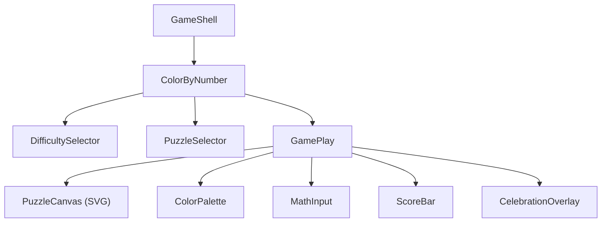
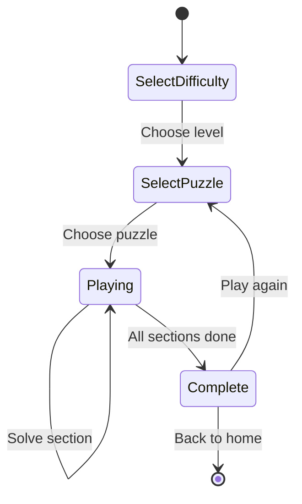

# 🎨 Color by Number — Architecture Document

A math-powered coloring game where kids solve equations to reveal hidden pictures.

---

## Game Concept

Players see a picture divided into numbered sections. Each section contains a **math equation** instead of a plain number. The player:

1. **Taps a section** on the canvas
2. **Solves the equation** shown for that section (e.g., `3 + 4`)
3. The **answer maps to a color** from the palette (e.g., `7 = 🟢 green`)
4. The section fills with the correct color
5. The **full picture is revealed** once all sections are colored

> [!IMPORTANT]
> The game targets ages 5–10. Equations should match the selected difficulty level and feel rewarding, not frustrating.

---

## Difficulty Levels

| Level | Hebrew | Operations | Number Range | Sections |
|-------|--------|------------|-------------|----------|
| Easy | קל | `+` only | 1–5 | 6–8 |
| Medium | בינוני | `+`, `-` | 1–10 | 8–12 |
| Hard | קשה | `+`, `-`, `×` | 1–12 | 12–16 |

---

## Data Models

### Puzzle Template

```typescript
interface PuzzleTemplate {
  id: string;
  name: string;
  nameHe: string;
  difficulty: 'easy' | 'medium' | 'hard';
  palette: ColorEntry[];       // color legend
  sections: PuzzleSection[];   // regions to color
  previewIcon: string;         // emoji hint (e.g. "🦋")
}
```

### Color Entry (Palette)

```typescript
interface ColorEntry {
  number: number;   // answer value → maps to this color
  color: string;    // hex CSS color
  nameHe: string;   // Hebrew label ("אדום")
}
```

### Puzzle Section

```typescript
interface PuzzleSection {
  id: number;
  path: string;          // SVG path data defining the region
  equation: string;      // display string: "3 + 4"
  answer: number;        // correct answer → maps to ColorEntry
  colorIndex: number;    // which palette color this section should be
}
```

### Game State

```typescript
interface ColorByNumberState {
  puzzle: PuzzleTemplate;
  difficulty: 'easy' | 'medium' | 'hard';
  completedSections: Set<number>;  // section IDs already colored
  selectedSection: number | null;  // currently active section
  score: number;
  mistakes: number;
  gamePhase: 'select-puzzle' | 'playing' | 'complete';
}
```

---

## Component Architecture



### Components

| Component | Responsibility |
|-----------|---------------|
| **ColorByNumber** | Main game class, state management, phase transitions |
| **DifficultySelector** | 3-button chooser (Easy/Medium/Hard) |
| **PuzzleSelector** | Grid of available puzzles for chosen difficulty |
| **PuzzleCanvas** | SVG rendering of the puzzle with clickable sections |
| **ColorPalette** | Shows the number → color legend |
| **MathInput** | Displays the equation and accepts answer input |
| **ScoreBar** | Progress indicator + score display |
| **CelebrationOverlay** | Confetti + stars when puzzle is complete |

---

## Game Flow



### Playing Flow (Detail)

1. Player **taps a section** on the SVG canvas
2. Section highlights with a pulsing border
3. **Equation panel** slides up showing the equation (e.g., `5 + 3 = ?`)
4. Player **types or taps** the answer using a number pad
5. **Correct answer** → section fills with color, +10 points, happy sound
6. **Wrong answer** → gentle shake animation, "נסה שוב!" message, try again
7. When all sections complete → **celebration overlay** with final score

---

## SVG Puzzle Format

Each puzzle is an SVG divided into `<path>` elements. Each path has a `data-section-id` attribute linking it to a `PuzzleSection`.

```svg
<svg viewBox="0 0 400 400">
  <!-- Section 1: answer=5, color=#ff6b6b -->
  <path data-section-id="1" d="M10,10 L200,10 L200,200 L10,200 Z"
        fill="#e0e0e0" stroke="#555" stroke-width="2" />
  
  <!-- Equation label centered in section -->
  <text data-label="1" x="105" y="110" text-anchor="middle">3 + 2</text>
</svg>
```

### States per section:

| State | Appearance |
|-------|-----------|
| **Unsolved** | Light gray fill (`#e0e0e0`), equation text visible |
| **Selected** | Pulsing golden border, slightly elevated |
| **Solved** | Filled with correct color, equation text hidden |

---

## Starter Puzzles (5 Included)

| # | Name | Hebrew | Icon | Difficulty | Sections |
|---|------|--------|------|-----------|----------|
| 1 | Star | כוכב | ⭐ | Easy | 6 |
| 2 | Heart | לב | ❤️ | Easy | 7 |
| 3 | House | בית | 🏠 | Medium | 10 |
| 4 | Butterfly | פרפר | 🦋 | Medium | 12 |
| 5 | Rocket | רקטה | 🚀 | Hard | 14 |

### Color Palette (Shared)

| Number | Color | Hebrew | Hex |
|--------|-------|--------|-----|
| 1 | Red | אדום | `#ff6b6b` |
| 2 | Blue | כחול | `#4ecdc4` |
| 3 | Yellow | צהוב | `#ffd93d` |
| 4 | Green | ירוק | `#6bcb77` |
| 5 | Purple | סגול | `#9b59b6` |
| 6 | Orange | כתום | `#ff8a5c` |
| 7 | Pink | ורוד | `#ff6b81` |
| 8 | Brown | חום | `#c4915e` |

---

## UI Layout

```
┌─────────────────────────────────────┐
│  ← חזרה    ⭐ כוכב    ניקוד: 40    │  ← ScoreBar
├─────────────────────────────────────┤
│                                     │
│         ┌───────────────┐           │
│         │               │           │
│         │  SVG Canvas   │           │  ← PuzzleCanvas
│         │  (clickable   │           │
│         │   sections)   │           │
│         │               │           │
│         └───────────────┘           │
│                                     │
│  ┌─ Color Palette ──────────────┐   │
│  │ 1:🔴  2:🔵  3:🟡  4:🟢     │   │  ← ColorPalette
│  │ 5:🟣  6:🟠  7:💟  8:🟤     │   │
│  └──────────────────────────────┘   │
│                                     │
│  ┌─ Equation Panel ─────────────┐   │
│  │    5 + 3 = [___]  ✓          │   │  ← MathInput
│  └──────────────────────────────┘   │
└─────────────────────────────────────┘
```

---

## File Structure

```
src/games/color-by-number/
├── ColorByNumber.ts          # Main game class (extends Component)
├── components/
│   ├── DifficultySelector.ts # Easy / Medium / Hard chooser
│   ├── PuzzleSelector.ts     # Puzzle grid with preview icons
│   ├── PuzzleCanvas.ts       # SVG rendering & interaction
│   ├── ColorPalette.ts       # Number → color legend display
│   ├── MathInput.ts          # Equation display + answer input
│   ├── ScoreBar.ts           # Progress bar + score
│   └── CelebrationOverlay.ts # Win screen with confetti
├── data/
│   ├── puzzles.ts            # All puzzle templates
│   └── palette.ts            # Shared color palette
├── utils/
│   └── equationGenerator.ts  # Generates equations for given answer + difficulty
└── styles/
    └── color-by-number.css   # All game-specific styles
```

---

## Key Design Decisions

1. **SVG-based canvas** — Scalable, resolution-independent, easy hit detection via path click events
2. **Equation generator** — Dynamically generates equations that produce the needed answer, randomized each play
3. **No keyboard required** — Number pad UI for mobile-friendly input (big touch targets for kids)
4. **Progressive difficulty** — Easy puzzles use simple addition with small numbers; hard puzzles include multiplication
5. **Forgiving mistakes** — Wrong answers don't end the game; gentle feedback encourages retrying
6. **Hebrew-first UI** — All labels in Hebrew with English fallback

---

## Scoring System

| Action | Points |
|--------|--------|
| Correct answer (first try) | +10 |
| Correct answer (second try) | +5 |
| Correct answer (third+ try) | +2 |
| Puzzle completion bonus | +20 |
| Perfect score (no mistakes) | +50 bonus |

---

## Animations

| Trigger | Animation |
|---------|-----------|
| Section tap | Golden pulse border (CSS keyframe) |
| Correct answer | Color flood fill (SVG transition 0.4s) |
| Wrong answer | Gentle shake (CSS transform) |
| Section complete | Small sparkle burst |
| Puzzle complete | Full celebration overlay with confetti + stars |
| Score change | Number counter animation (count up) |

---

## Verification Plan

### Automated
- `npx tsc --noEmit` — zero errors
- Equation generator produces valid equations for all difficulty levels
- All puzzle paths render correctly in SVG

### Manual
- Play through each puzzle at each difficulty
- Verify correct color mapping
- Test on mobile (touch targets ≥ 44px)
- Test RTL layout
- Verify celebration plays on completion

---

## Implementation Phases

### Phase A — Data & Core Logic
- [ ] Define TypeScript interfaces
- [ ] Create color palette data
- [ ] Build equation generator utility
- [ ] Create 5 SVG puzzle templates with path data
- [ ] Unit tests for equation generator

### Phase B — Game UI Components
- [ ] `ColorByNumber.ts` main game class
- [ ] `DifficultySelector.ts`
- [ ] `PuzzleSelector.ts`
- [ ] `PuzzleCanvas.ts` with SVG rendering
- [ ] `ColorPalette.ts`
- [ ] `MathInput.ts` with number pad
- [ ] `ScoreBar.ts`

### Phase C — Game Logic & Integration
- [ ] Wire up section selection → equation display → answer checking
- [ ] Score tracking
- [ ] Progress tracking (sections completed)
- [ ] `CelebrationOverlay.ts`
- [ ] Register game in `GameRegistry` as available

### Phase D — Styling & Polish
- [ ] `color-by-number.css` with all animations
- [ ] Mobile responsive layout
- [ ] Sound effects (optional)
- [ ] Final testing pass
