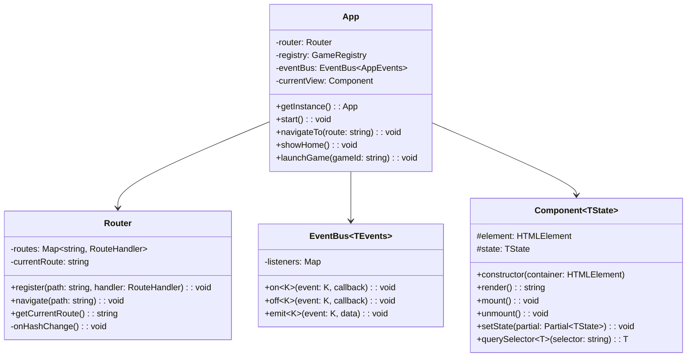
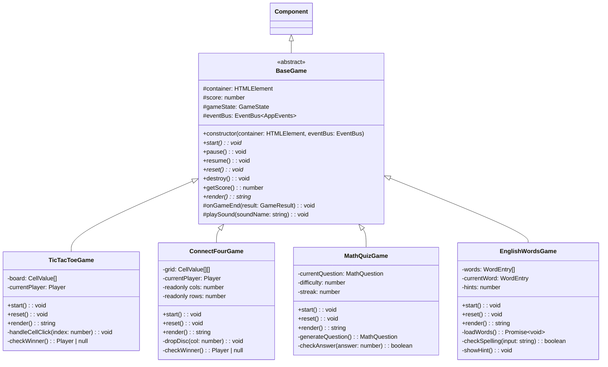
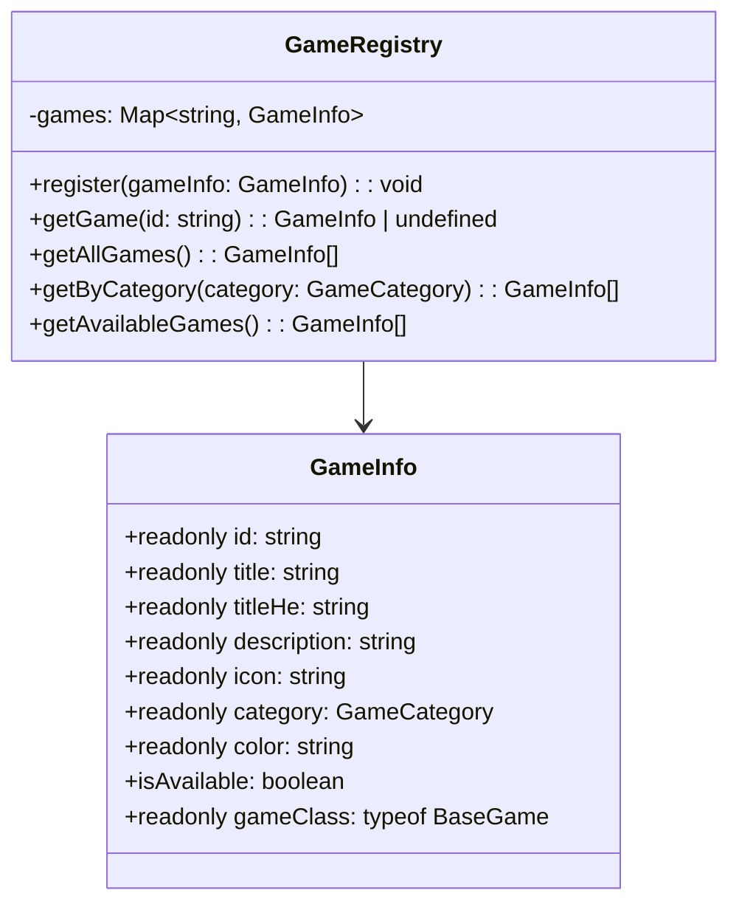

# 🎮 Game Box — Architecture Document

> אתר משחקים חינוכי ומהנה לילדים בכיתה א', עם דגש על לימוד חשבון ואנגלית.

## Background & Goals

**Game Box** is a web-based game hub for young children (1st grade). It features:

- A **vibrant, animated home screen** designed to delight kids
- A growing collection of **educational games** (math, English) and **fun games** (tic-tac-toe, Connect Four, etc.)
- A **modular, OOP architecture** so each game is a self-contained module that can be added, removed, or updated independently

**Phase 1 (current):** Build the home screen UI and the extensible game framework — no actual games yet.

---

## Technology Stack

| Layer | Choice | Rationale |
|-------|--------|-----------|
| Bundler | **Vite 6** | Fastest dev server, native ESM, TS support out of the box |
| Language | **TypeScript 5.7** (strict mode) | Type safety, better IDE support, safer refactoring as the project grows |
| Styling | **Vanilla CSS** with CSS Custom Properties, `@layer`, nesting | Modern CSS features — full control, no build overhead, kid-friendly design |
| Fonts | **Google Fonts** (Rubik for Hebrew, Fredoka One for English/fun) | Rounded, playful, kid-friendly typography |
| Animations | **CSS Animations + Web Animations API** | Smooth, performant, programmatic control when needed |
| Routing | **Hash-based SPA router** (custom, ~50 lines) | Simple, no dependencies, works with static hosting |
| Config | **tsconfig.json** (strict) | Enforces best practices — `noImplicitAny`, `strictNullChecks`, etc. |

### Why TypeScript?

- **Type-safe game registry** — `GameInfo` is a typed interface, so every game registration is validated at compile time
- **Abstract class enforcement** — `BaseGame` abstract methods are enforced by the compiler, not just by convention
- **Generics** — `Component<TState>` ensures each component's state is properly typed
- **Refactoring confidence** — as we add 8+ games over time, renaming or changing interfaces is safe

---

## Project Structure

```
F:\Coding Projects\Game Box\
├── index.html                  # Entry point
├── vite.config.ts              # Vite configuration (TypeScript)
├── tsconfig.json               # TypeScript strict configuration
├── package.json
│
├── public/
│   └── assets/
│       ├── images/             # Game thumbnails, icons, backgrounds
│       └── sounds/             # UI sound effects (click, success, etc.)
│
├── src/
│   ├── main.ts                 # App bootstrap & router init
│   │
│   ├── types/                  # Shared type definitions
│   │   └── index.ts            # Interfaces, enums, type aliases
│   │
│   ├── core/                   # Core framework classes
│   │   ├── App.ts              # Application singleton — manages routing & state
│   │   ├── Router.ts           # Hash-based SPA router
│   │   ├── Component.ts        # Generic base UI component class
│   │   └── EventBus.ts         # Typed pub/sub event system
│   │
│   ├── models/                 # Data models
│   │   ├── GameInfo.ts         # Game metadata class (implements IGameInfo)
│   │   └── GameRegistry.ts     # Central registry with typed Map
│   │
│   ├── games/                  # One folder per game (added over time)
│   │   ├── BaseGame.ts         # Abstract base class every game extends
│   │   ├── tic-tac-toe/
│   │   │   ├── TicTacToeGame.ts
│   │   │   └── tic-tac-toe.css
│   │   ├── connect-four/
│   │   │   ├── ConnectFourGame.ts
│   │   │   └── connect-four.css
│   │   ├── math-quiz/
│   │   │   ├── MathQuizGame.ts
│   │   │   └── math-quiz.css
│   │   └── english-words/
│   │       ├── EnglishWordsGame.ts
│   │       └── english-words.css
│   │
│   ├── components/             # Shared UI components
│   │   ├── HomeScreen.ts       # Main landing page with game grid
│   │   ├── GameCard.ts         # Individual game card in the grid
│   │   ├── Header.ts           # Top bar with logo & navigation
│   │   ├── ParticleBackground.ts  # Canvas-based animated background
│   │   ├── CategoryFilter.ts   # Filter buttons (All / Math / English / Fun)
│   │   └── GameShell.ts        # Wrapper around any active game
│   │
│   └── styles/
│       ├── index.css           # Master @import + @layer ordering
│       ├── variables.css       # CSS custom properties (colors, spacing, fonts)
│       ├── reset.css           # CSS reset / normalize
│       ├── typography.css      # Font faces & text styles
│       ├── animations.css      # Reusable @keyframes
│       ├── components.css      # Shared component styles
│       └── home.css            # Home screen specific styles
│
└── tests/                      # Future: unit / integration tests
```

---

## Type System

### Shared Interfaces & Enums (`src/types/index.ts`)

```typescript
/** Game categories as a union type */
export type GameCategory = 'math' | 'english' | 'fun';

/** Game state during gameplay */
export type GameState = 'idle' | 'playing' | 'paused' | 'ended';

/** Result emitted when a game ends */
export interface GameResult {
  score: number;
  won: boolean;
  duration: number; // ms
}

/** Configuration for registering a game */
export interface IGameInfo {
  id: string;
  title: string;
  titleHe: string;
  description: string;
  icon: string;
  category: GameCategory;
  color: string;
  isAvailable: boolean;
  gameClass: new (container: HTMLElement, eventBus: EventBus) => BaseGame;
}

/** Typed event map for EventBus */
export interface AppEvents {
  'game:start':   { gameId: string };
  'game:end':     GameResult;
  'game:pause':   void;
  'game:resume':  void;
  'navigate':     { route: string };
  'category:change': { category: GameCategory | 'all' };
}
```

---

## Class Hierarchy & OOP Design

### Core Classes



### Game Classes



### Data Models



---

## Key Design Principles

### 1. Adding a New Game (Extension Pattern)

Adding a new game requires only 3 steps — **no existing code changes**:

```
1. Create a new folder: src/games/my-new-game/
2. Create MyNewGame.ts extending BaseGame (compiler enforces all abstract methods)
3. Register it in GameRegistry (one line in main.ts)
```

```typescript
// Example: registering a new game — fully type-checked
registry.register(new GameInfo({
  id: 'memory-cards',
  title: 'Memory Cards',
  titleHe: 'משחק זיכרון',
  description: 'Find matching pairs!',
  icon: '🃏',
  category: 'fun',       // ← autocomplete: 'math' | 'english' | 'fun'
  color: '#FF6B9D',
  isAvailable: true,
  gameClass: MemoryCardsGame, // ← must extend BaseGame
}));
```

### 2. Component Lifecycle

Every `Component<TState>` follows a predictable lifecycle:

```
constructor() → render() → mount() → [setState(Partial<TState>) → render()] → unmount()
```

### 3. Typed Event-Driven Communication

Components communicate through a **typed `EventBus<AppEvents>`** — both decoupled and compile-time safe:

```typescript
// Emitting — TypeScript enforces the correct payload shape
eventBus.emit('game:end', { score: 10, won: true, duration: 45000 });

// Listening — callback parameter is automatically typed
eventBus.on('game:end', (result) => {
  console.log(result.score); // ✅ TypeScript knows this is a number
});
```

### 4. RTL Support

The app supports Hebrew (RTL). The `<html dir="rtl">` attribute is set, and CSS uses logical properties (`margin-inline-start` instead of `margin-left`).

---

## Home Screen Design Concept

The home screen is the centerpiece of Phase 1:

| Element | Description |
|---------|-------------|
| **Animated background** | Floating colorful shapes (circles, stars, triangles) with slow drift animation |
| **Logo** | "🎮 Game Box" with a bouncy entrance animation and playful font |
| **Category tabs** | Pill-shaped buttons: הכל 🌟 · חשבון 🔢 · אנגלית 🔤 · כיף 🎉 |
| **Game cards grid** | Large, colorful cards with emoji icon, game name, and subtle hover wobble |
| **Unavailable games** | Shown with reduced opacity + "...בקרוב" (coming soon) badge |
| **Confetti burst** | Triggers on first load and when hovering the logo |

### Color Palette

```css
--color-bg:         #1a1a2e;    /* Deep navy background */
--color-surface:    #16213e;    /* Card surfaces */
--color-primary:    #e94560;    /* Primary accent — vibrant pink-red */
--color-secondary:  #0f3460;    /* Secondary — deep blue */
--color-math:       #f39c12;    /* Math category — warm orange */
--color-english:    #2ecc71;    /* English category — friendly green */
--color-fun:        #9b59b6;    /* Fun category — playful purple */
--color-text:       #ffffff;
--color-text-muted: #a0a0b8;
```

---

## Initial Game List

| # | Game | Category | Icon | Status |
|---|------|----------|------|--------|
| 1 | **איקס עיגול** (Tic-Tac-Toe) | כיף 🎉 | ❌⭕ | 🔜 Coming soon |
| 2 | **4 בשורה** (Connect Four) | כיף 🎉 | 🔴🟡 | 🔜 Coming soon |
| 3 | **חידון חשבון** (Math Quiz) | חשבון 🔢 | ➕✖️ | 🔜 Coming soon |
| 4 | **אותיות באנגלית** (English Letters) | אנגלית 🔤 | 🔤 | 🔜 Coming soon |
| 5 | **משחק זיכרון** (Memory Cards) | כיף 🎉 | 🃏 | 🔜 Coming soon |
| 6 | **חיבור וחיסור** (Add & Subtract) | חשבון 🔢 | ➕➖ | 🔜 Coming soon |
| 7 | **איות מילים** (Spell It!) | אנגלית 🔤 | ✏️ | 🔜 Coming soon |
| 8 | **צביעה לפי מספרים** (Color by Number) | חשבון 🔢 | 🎨 | 🔜 Coming soon |

---

## Proposed Changes

### Phase 1 — UI Shell (Current Scope)

Project scaffold and home screen only — no playable games yet.

#### [NEW] [package.json](file:///F:/Coding Projects/Game Box/package.json)
Vite + TypeScript dev dependencies, project metadata, `dev`/`build` scripts.

#### [NEW] [vite.config.ts](file:///F:/Coding Projects/Game Box/vite.config.ts)
Minimal Vite config with `src` root.

#### [NEW] [tsconfig.json](file:///F:/Coding Projects/Game Box/tsconfig.json)
Strict TypeScript config — `strict: true`, `noImplicitAny`, `strictNullChecks`, ES2022 target.

#### [NEW] [index.html](file:///F:/Coding Projects/Game Box/index.html)
Single HTML entry point with `<div id="app">`, Google Fonts link, RTL support.

#### [NEW] [src/main.ts](file:///F:/Coding Projects/Game Box/src/main.ts)
Bootstrap the `App` singleton, register game metadata, start router.

---

#### Type Definitions

#### [NEW] [index.ts](file:///F:/Coding Projects/Game Box/src/types/index.ts)
Shared interfaces (`IGameInfo`, `GameResult`, `AppEvents`), enums (`GameCategory`, `GameState`).

---

#### Core Framework

#### [NEW] [App.ts](file:///F:/Coding Projects/Game Box/src/core/App.ts)
Singleton application class — owns Router, EventBus, GameRegistry, manages view lifecycle.

#### [NEW] [Router.ts](file:///F:/Coding Projects/Game Box/src/core/Router.ts)
Hash-based SPA router with `register()`, `navigate()`, and `onHashChange` listener.

#### [NEW] [Component.ts](file:///F:/Coding Projects/Game Box/src/core/Component.ts)
Generic abstract base `Component<TState>` with `render()`, `mount()`, `unmount()`, `setState(Partial<TState>)`.

#### [NEW] [EventBus.ts](file:///F:/Coding Projects/Game Box/src/core/EventBus.ts)
Generic typed pub/sub `EventBus<TEvents>` — ensures event payloads match their types.

---

#### Data Models

#### [NEW] [GameInfo.ts](file:///F:/Coding Projects/Game Box/src/models/GameInfo.ts)
Immutable data class implementing `IGameInfo` with `readonly` properties.

#### [NEW] [GameRegistry.ts](file:///F:/Coding Projects/Game Box/src/models/GameRegistry.ts)
Central `Map<string, GameInfo>` with typed category filtering.

---

#### UI Components

#### [NEW] [HomeScreen.ts](file:///F:/Coding Projects/Game Box/src/components/HomeScreen.ts)
Main landing page — renders header, category filter, and game card grid.

#### [NEW] [GameCard.ts](file:///F:/Coding Projects/Game Box/src/components/GameCard.ts)
Individual game card with icon, title, color, hover animation, and "coming soon" badge.

#### [NEW] [Header.ts](file:///F:/Coding Projects/Game Box/src/components/Header.ts)
Top bar with animated logo.

#### [NEW] [ParticleBackground.ts](file:///F:/Coding Projects/Game Box/src/components/ParticleBackground.ts)
Canvas-based floating shapes animation using requestAnimationFrame.

#### [NEW] [CategoryFilter.ts](file:///F:/Coding Projects/Game Box/src/components/CategoryFilter.ts)
Pill-shaped category filter buttons with active state.

#### [NEW] [GameShell.ts](file:///F:/Coding Projects/Game Box/src/components/GameShell.ts)
Wrapper displayed when a game is active — back button, score display, game container.

---

#### Game Framework

#### [NEW] [BaseGame.ts](file:///F:/Coding Projects/Game Box/src/games/BaseGame.ts)
Abstract base class with enforced abstract methods: `start()`, `reset()`, `render()`.

---

#### Styles

#### [NEW] [index.css](file:///F:/Coding Projects/Game Box/src/styles/index.css)
Master `@import` file with `@layer` ordering (reset, tokens, typography, components, pages).

#### [NEW] [variables.css](file:///F:/Coding Projects/Game Box/src/styles/variables.css)
CSS custom properties — colors, spacing, border-radius, font families, shadows.

#### [NEW] [reset.css](file:///F:/Coding Projects/Game Box/src/styles/reset.css)
Minimal CSS reset.

#### [NEW] [typography.css](file:///F:/Coding Projects/Game Box/src/styles/typography.css)
Google Fonts imports, heading styles, RTL text settings.

#### [NEW] [animations.css](file:///F:/Coding Projects/Game Box/src/styles/animations.css)
Reusable `@keyframes` (float, bounce, wobble, fadeIn, pulse, confetti).

#### [NEW] [components.css](file:///F:/Coding Projects/Game Box/src/styles/components.css)
Styles for shared components (cards, buttons, badges).

#### [NEW] [home.css](file:///F:/Coding Projects/Game Box/src/styles/home.css)
Home screen layout, game grid, category filter pills.

---

## Verification Plan

### Automated Tests
1. **TypeScript compiles without errors:**
   ```bash
   npx tsc --noEmit
   ```

2. **Dev server starts successfully:**
   ```bash
   npm run dev
   ```

3. **Browser visual check:**
   Open `http://localhost:5173` in the browser and verify:
   - Animated background renders
   - Logo with bounce animation appears
   - Category filter buttons are visible and clickable
   - Game cards grid is rendered with all 8 games
   - "Coming soon" badges appear on all cards
   - Hovering a card triggers wobble animation
   - Clicking a category filters the cards
   - RTL layout is correct

### Manual Verification
- Ask the user to open the dev server URL and visually confirm the design matches the kid-friendly aesthetic described above.
